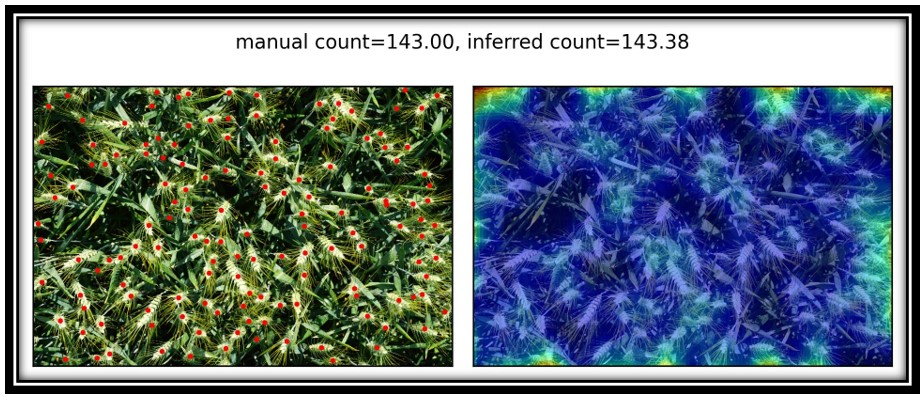

# Model Refinement on TasselNetv2+ 模型改进

<p align="center">
  
</p>
基于陆昊老师的TasselNetv2+植物计数网络。<br>
本章中提出了一些方法，试图从算法类型，网络结构，参数大小三个角度出发，寻找提升模型性能的方法。<br>   
由于原模型对在高粱穗数据集上的表现已经较好，对改进模型的训练主要在玉米穗数据集和麦穗数据集上进行。

## 改变算法类型
### 改变激活函数
原模型卷积层激活函数为ReLU，考虑将其更换为LeakyReLU是否能提升模型性能。<br><br>
#### 在玉米穗数据集上的训练结果
best mae: 5.19, best mse: 9.13, best_rmae: 37.67, best_rmse: 82.45, best_r2: 0.8861<br>
与原模型相比，mae指标从5.48下降到5.19，mse指标从10.06下降到9.13，性能有一定的提升。<br><br>
在麦穗数据集上的训练结果：<br>
best mae: 5.93, best mse: 7.81, best_rmae: 4.39, best_rmse: 5.68, best_r2: 0.8612<br>
很遗憾，各项性能指标都变差了。<br><br>
结论：更换激活函数为LeakyReLU能一定程度提升模型在玉米穗数据集上的性能。<br>

### 改变损失函数
原模型以torch.nn.L1loss即平均绝对误差为损失函数，考虑更换损失函数是否能提升模型性能。<br><br>
机器学习中，损失函数(Loss Function)用于定义单个训练样本与真实值之间的误差。训练模型的目的即是最小化损失函数。<br>
平均绝对误差(Mean Absolute Error, MAE)，也称L1loss，为目标值与预测值之差绝对值和的均值，<br>
均方误差(Mean Squared Error, MSE)，也称L2loss，为目标值与预测值之差平方和的均值的二分之一,<br>
平滑L1损失(Smooth L1 Loss, SLL)，优化的平均绝对误差。<br><br>
采用MSE作为损失函数，在玉米穗数据集上的训练结果：<br>
best mae: 5.90, best mse: 9.64, best_rmae: 44.87, best_rmse: 103.97, best_r2: 0.8776<br>
性能一定程度上变差。<br><br>
在麦穗数据集上训练的结果：<br>
best mae: 4.47, best mse: 5.39, best_rmae: 3.42, best_rmse: 4.14, best_r2: 0.9212<br>
与原模型相比，mae和rmae指标基本相同，mse和rmse指标有一定的提升。<br><br>
结论：更换损失函数为MAE能一定程度提升模型在麦穗数据集上的性能。<br><br><br>
采用SLL作为损失函数，在玉米穗数据集上的训练结果：<br>
best mae: 6.06, best mse: 10.59, best_rmae: 40.69, best_rmse: 81.99, best_r2: 0.8449<br><br>
在麦穗数据集上的训练结果：<br>
best mae: 4.57, best mse: 5.67, best_rmae: 3.43, best_rmse: 4.21, best_r2: 0.9163<br>
与原模型相比，在两个数据集上的性能指标都下降。<br><br>
结论：采用SLL作为损失函数无法提升模型性能。<br>


## Prepare Your Data
**Wheat Ears Counting**
1. Download the Wheat Ears Counting (WEC) dataset from: [Google Drive (2.5 GB)](https://drive.google.com/open?id=1XHcTqRWf-xD-WuBeJ0C9KfIN8ye6cnSs). I have reorganized the data, the credit of this dataset belongs to [this repository](https://github.com/simonMadec/Wheat-Ears-Detection-Dataset).
2. Unzip the dataset and move it into the `./data` folder, the path structure should look like this:
````
$./data/wheat_ears_counting_dataset
├──── train
│    ├──── images
│    └──── labels
├──── val
│    ├──── images
│    └──── labels
````

**Maize Tassels Counting**
1. Download the Maize Tassels Counting (MTC) dataset from: [Google Drive (1.8 GB)](https://drive.google.com/open?id=1IyGpYMS_6eClco2zpHKzW5QDUuZqfVFJ)
2. Unzip the dataset and move it into the `./data` folder, the path structure should look like this:
````
$./data/maize_counting_dataset
├──── trainval
│    ├──── images
│    └──── labels
├──── test
│    ├──── images
│    └──── labels
````

**Sorghum Heads Counting**
1. Download the Sorghum Heads Counting (SHC) dataset from: [Google Drive (152 MB)](https://drive.google.com/open?id=1msk8vYDyKdrYDq5zU1kKWOxfmgaXpy-P). The credit of this dataset belongs to [this repository](https://github.com/oceam/sorghum-head). I only use the two subsets that have dotted annotations available.
2. Unzip the dataset and move it into the `./data` folder, the path structure should look like this:
````
$./data/sorghum_head_counting_dataset
├──── original
│    ├──── dataset1
│    └──── dataset2
├──── labeled
│    ├──── dataset1
│    └──── dataset2
````

## Inference
Run the following command to reproduce our results of TasselNetv2+ on the WEC/MTC/SHC dataset:

    sh config/hl_wec_eval.sh
    
    sh config/hl_mtc_eval.sh
    
    sh config/hl_shc_eval.sh
    
- Results are saved in the path `./results/$dataset/$exp/$epoch`.
  
## Training
Run the following command to train TasselNetv2+ on the on the WEC/MTC/SHC dataset:

    sh config/hl_wec_train.sh
    
    sh config/hl_mtc_train.sh
    
    sh config/hl_shc_train.sh
    
    
## Play with Your Own Dataset
To use this framework on your own dataset, you may need to:
1. Annotate your data with dotted annotations. I recommend the [VGG Image Annotator](http://www.robots.ox.ac.uk/~vgg/software/via/);
2. Generate train/validation list following the example in `gen_trainval_list.py`;
3. Write your dataloader following example codes in `hldataset.py`;
4. Compute the mean and standard deviation of RGB on the training set;
5. Create a new entry in the `dataset_list` in `hltrainval.py`;
6. Create a new `your_dataset.sh` following examples in `./config` and modify the hyper-parameters (e.g., batch size, crop size) if applicable.
7. Train and test your model. Happy playing:)

## Citation
If you find this work or code useful for your research, please cite:
```
@article{lu2020tasselnetv2plus,
  title={TasselNetV2+: A fast implementation for high-throughput plant counting from high-resolution RGB imagery},
  author={Lu, Hao and Cao, Zhiguo},
  journal={Frontiers in Plant Science},
  year={2020}
}

@article{xiong2019tasselnetv2,
  title={TasselNetv2: in-field counting of wheat spikes with context-augmented local regression networks},
  author={Xiong, Haipeng and Cao, Zhiguo and Lu, Hao and Madec, Simon and Liu, Liang and Shen, Chunhua},
  journal={Plant Methods},
  volume={15},
  number={1},
  pages={150},
  year={2019},
  publisher={Springer}
}
```

## Permission
This code is only for non-commercial purposes. Please contact Hao Lu (hlu@hust.edu.cn) if you are interested in commerial use.
