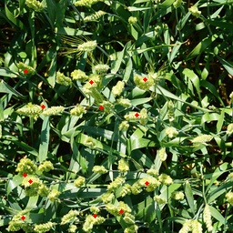
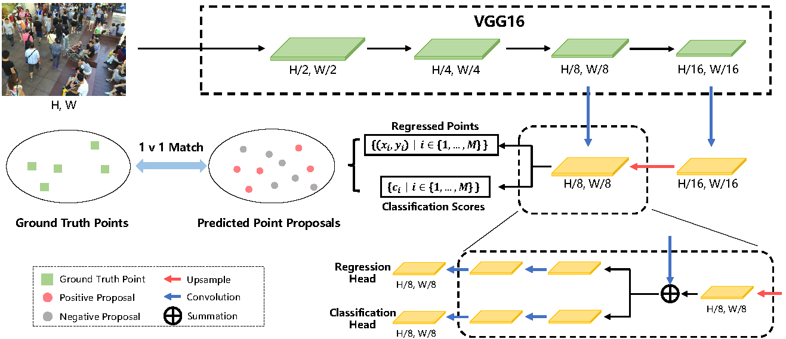

# 人群计数模型P2PNet

这个仓库包含了两部分内容： 
* 一是基于人群计数模型**P2PNet**迁移到植物计数数据集上的代码，论文见[Rethinking Counting and Localization in Crowds: A Purely Point-Based Framework](https://arxiv.org/abs/2107.12746). 
* 二是将**Global Wheat Head Detection Dataset**转换为适用于TasselNetv2+模型和P2PNet模型的代码，论文见[Global Wheat Head Detection (GWHD) dataset: a large and diverse dataset of high resolution RGB labelled images to develop and benchmark wheat head detection methods](https://arxiv.org/abs/2005.02162).
 

## P2PNet的可视化测试结果
 

## 网络结构
P2PNet的整体结构如下。在VGG16的基础上，首先引入了一个上采样路径来获得细粒度的特征图。
然后，利用两个分支来同时预测一组点和它们的置信度分数。

   

## Performance on the Wheat Ears Counting Dataset.
| Method        | MAE   | MSE   |
| ------------- | ----- | ----- |
| TasselNetv2+  | 4.44  | 5.41  |
| P2PNet        | 4.0   | 5.40  |

可以看出在Wheat Ears Counting Dataset上P2PNet的性能优于 TasselNetv2+.

## Performance on the Maize Tassels Counting Dataset.
| Method        | MAE   | MSE   |
| ------------- | ----- | ----- |
| TasselNetv2+  | 5.48  | 10.06 |
| P2PNet        | 9.19  | 9.38  |

可以看出在Maize Tassels Counting Dataset上P2PNet的性能要比 TasselNetv2+差.

## Performance on the Global Wheat Head Detection Dataset.
通过该仓库中global_wheat_detection_TasselNetv2+和global_wheat_detection_p2p中的代码，把原始数据标注格式转换成适用于TasselNetv2+模型和P2PNet模型的格式，然后进行训练得到如下结果：
| Method        | MAE   | MSE   |
| ------------- | ----- | ----- |
| TasselNetv2+  | 6.23  | 7.25  |
| P2PNet        | 4.06  | 5.68  |

可以看出在Global Wheat Head Detection Dataset上P2PNet性能更佳.

## 性能比较
根据上述实验结果可知，在Global Wheat Head Detection (GWHD) Dataset和Wheat Ears Counting Dataset上P2PNet的性能优于TasselNetv2+。考虑以下几个因素：

1. 网络架构：P2PNet 和 TasselNetv2+ 使用不同的网络架构。P2PNet 可能在设计上具有更好的特征提取和表示能力，能够更好地捕捉到小麦头部的特征。

2. 数据预处理和增强技术：P2PNet 可能使用了更有效的数据预处理和增强技术，使得输入数据更具有鲁棒性和可区分性。这可能有助于提高模型在这些数据集上的性能。

3. 损失函数和优化算法：P2PNet 可能使用了更适合这些数据集的损失函数和优化算法，使得模型能够更好地拟合数据并优化性能。

综上所述，P2PNet 在 GWHD 数据集和 Wheat Ears Counting 数据集上的性能优于 TasselNetv2+ 可能是由于更合适的网络架构、有效的数据预处理和增强技术以及更适合数据集的损失函数和优化算法等因素。

而在 Maize Tassels Counting Dataset 上 P2PNet 的性能比 TasselNetv2+ 差，考虑以下几个因素：

1. 数据集的特征：Maize Tassels Counting Dataset 可能具有与其他数据集不同的特征和数据分布。P2PNet 可能在设计上更适用于捕捉小麦头部的特征，而不太适用于玉米穗的特征。因此，P2PNet 在 Maize Tassels Counting Dataset 上可能无法有效地提取和表示相关特征，导致性能较差。

2. 数据预处理和增强技术：Maize Tassels Counting Dataset 可能需要特定的数据预处理和增强技术，以便更好地适应模型的输入要求和数据特点。P2PNet 的数据处理部分可能不适应玉米穗的数据，从而导致性能不好。

3. 训练策略和参数调整：训练策略和参数调整对于模型在特定数据集上的性能表现非常重要。P2PNet 可能在 Maize Tassels Counting Dataset 上的训练策略和参数调整不够合适，导致模型无法充分学习和适应数据集的特征，从而性能较差。

综上所述，P2PNet 在 Maize Tassels Counting Dataset 上的性能比 TasselNetv2+ 差可能是由于数据集特征的差异、不适合的数据预处理和增强技术以及训练策略和参数调整不合适等因素的综合影响。

从数据图片中也可以清晰地看出，Wheat Ears Counting Dataset中的数据图片特征更加近似于人群计数数据图片的特征，目标点的分布较均匀、密集而且数量比较多。另外P2PNet采用“点”作为训练数据，虽然保留了最原始的高精度数据，但也欠缺了对于密度变化的考虑，因此在Maize Tassels Counting Dataset这种密度变化不均匀的数据上的性能不佳。

## 植物计数VS人群计数
### 相同点
1. 计数目标：植物计数和人群计数都是要求对目标进行数量估计，即统计植物数量或人群数量。
2. 计数方法：两者都可以使用计算机视觉和图像处理技术进行计数，例如使用深度学习模型和图像分割算法。

### 不同点
1. 目标类型：植物计数是对植物个体进行计数，而人群计数是对人群中的个体进行计数。
2. 复杂性：人群计数相对于植物计数更具挑战性，因为人群中的个体可能存在遮挡、姿态变化、尺度变化等问题，而植物通常较为单一且位置相对固定。
3. 上下文信息：人群计数通常还需要考虑上下文信息，例如人与人之间的关系、人群密度分布等，而植物计数通常更关注个体的数量。
4. 应用场景：植物计数主要应用于农业领域，例如估计作物产量；人群计数则广泛应用于安防、城市规划、交通管理等领域。
