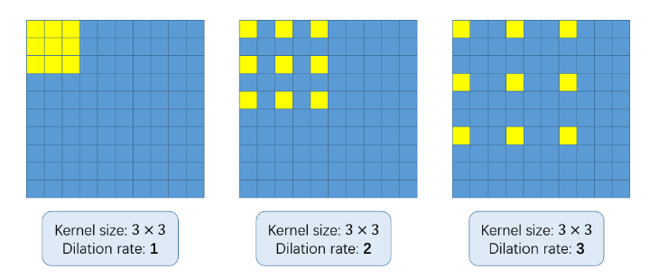
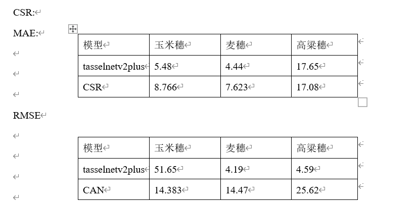
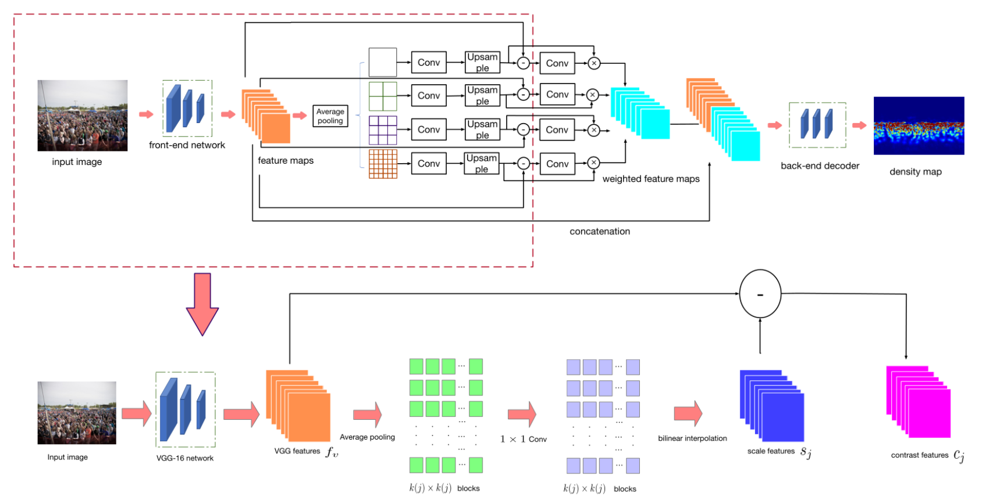
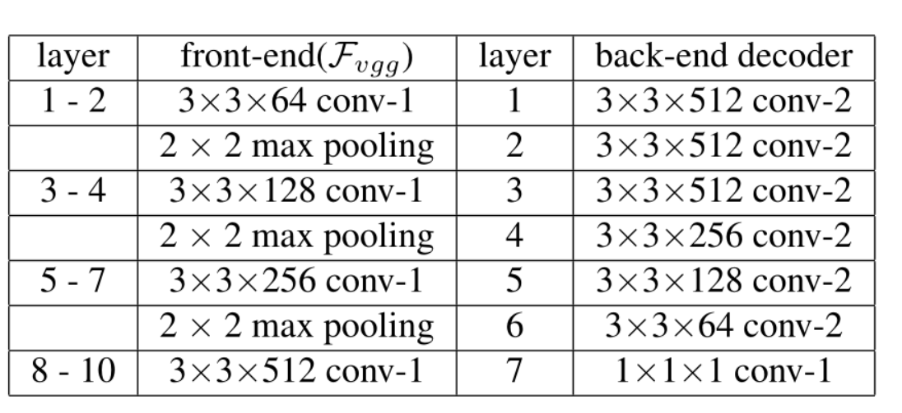
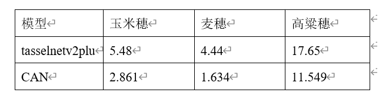

# PR-2023
开源模型中使用到的数据集和转化后的.h文件等由于数据太大并未上传，如若需要可联系hqking@hust.edu.cn,代码见各文件夹中，具体请参考模式识别报告书（尚未上传），训练使用服务器，配置为3090

## 一、修改部分在CPU环境下运行代码会无法支持的代码，并对代码添加注释,由于代码过多，只列出部分，详情参考所提交的代码
***gen_trainval_list.py***

```python
import os
import glob
import random
root = './data/wheat_ears_counting_dataset'#文件目录
image_folder = 'images'#目录下保存图片的目录
label_folder = 'labels'#标签
train = 'train'
val = 'val'

train_path = os.path.join(root, train)#训练路径
with open('train.txt', 'w') as f:#打开该文件
    for image_path in glob.glob(os.path.join(train_path, image_folder, '*.JPG')):#读取图片
        im_path = image_path.replace(root, '')
        gt_path = im_path.replace(image_folder, label_folder).replace('.JPG', '.xml')
        f.write(im_path+'\t'+gt_path+'\n')

val_path = os.path.join(root, val)
with open('val.txt', 'w') as f:
    for image_path in glob.glob(os.path.join(val_path, image_folder, '*.JPG')):
        im_path = image_path.replace(root, '')
        gt_path = im_path.replace(image_folder, label_folder).replace('.JPG', '.xml')
        f.write(im_path+'\t'+gt_path+'\n')

```
## 二、添加早停
早停法的核心思想是在训练过程中检验模型在验证数据上的表现，一旦验证损失停止减小（或者连续几轮未明显减小），就停止训练。

early_stop
```python
# -*- coding = utf-8 -*-
# @TIME: 2023/4/23 19:21
# @Author :hqKing
# @File : early_stop.py
import numpy as np
import torch
import os

class EarlyStopping:
    """Early stops the training if validation loss doesn't improve after a given patience."""
    def __init__(self, save_path, patience=7, verbose=False, delta=0):
        """
        Args:
            save_path : 模型保存文件夹
            patience (int): How long to wait after last time validation loss improved.
                            Default: 7
            verbose (bool): If True, prints a message for each validation loss improvement.
                            Default: False
            delta (float): Minimum change in the monitored quantity to qualify as an improvement.
                            Default: 0
        """
        self.save_path = save_path
        self.patience = patience
        self.verbose = verbose
        self.counter = 0
        self.best_score = None
        self.early_stop = False
        self.val_loss_min = np.Inf
        self.delta = delta

    def __call__(self, val_loss, model):

        score = -val_loss

        if self.best_score is None:
            self.best_score = score
            self.save_checkpoint(val_loss, model)
        elif score < self.best_score + self.delta:
            self.counter += 1
            print(f'EarlyStopping counter: {self.counter} out of {self.patience}')
            if self.counter >= self.patience:
                self.early_stop = True
        else:
            self.best_score = score
            self.save_checkpoint(val_loss, model)
            self.counter = 0

    def save_checkpoint(self, val_loss, model):
        '''Saves model when validation loss decrease.'''
        if self.verbose:
            print(f'Validation loss decreased ({self.val_loss_min:.6f} --> {val_loss:.6f}).  Saving model ...')
        path = os.path.join(self.save_path, 'best_network.pth')
        torch.save(model.state_dict(), path)	# 这里会存储迄今最优模型的参数
        self.val_loss_min = val_loss

```
## 三、修复部分bug
在haldataset代码中关于maize数据集的代码在读取bbs时存在bug，标注为点集，然而源代码中的处理是把标注当为boundbox来处理了，导致读取格式错误，修改后如下
```python

    def bbs2points(self, bbs): 
        points = []
        for bb in bbs:
            x, y = [float(b) for b in bb]#标注就是点，无需转换
            # x2, y2 = x1+w-1, y1+h-1
            # x, y = np.round((x1+x2)/2).astype(np.int32), np.round((y1+y2)/2).astype(np.int32)#求中心点
            points.append([x, y])#添加到点集
        return points
    
```
## 四、人群计数开源模型迁移到植物计数

### CSRNet

CSRNet是一种数据驱动的深度学习方法，可以理解高度拥挤的场景，进行精确的计数估计，并提供高质量的密度图
CSRNet由两个主要部分组成：一个是作为二维特征提取的前端卷积神经网络（即模型中的前端网络frontend ），另一个是用于后端的扩展CNN（后端网络backend），它使用扩展的核（空洞卷积操作）来传递更大的感受野，并代替池化操作，在目前主流的人群计数模型中一般都是使用密度图来呈现的，然而，如何生成准确的密度分布图是一个挑战。一个主要的困难来自于预测方式：由于生成的密度值遵循逐像素的预测，因此输出的密度图必须包含空间相关性，以便能够呈现最近像素之间的平滑过渡，CSRnet提出的改进为设计一个基于CNN的密度图生成器。模型使用纯卷积层作为主干来支持具有灵活分辨率的输入图像。为了限制网络的复杂度，在所有层中使用小尺寸的卷积滤波器（如3×3）。我们将VGG-16[21]的前10层作为前端，将空洞卷积层（dilated convolution layers）作为后端，以扩大感受野并在不丢失分辨率的情况下提取更深层的特征（因为不使用池化层），使用该架构跑出的效果达到了当时的soat

<div align=center>

</div>
其结构中最大的创新就是提出了空洞卷积，在分割任务中，空洞的卷积层已经被证明可以显著提高精度，它是池化层的一个很好的替代方案。虽然池化（如最大池化和平均池化）被广泛用于保持不变性和控制过拟合，但它们也会显著降低空间分辨率，意味着特征地图的空间信息丢失。反卷积层可以减轻信息的丢失，但是额外的复杂性和执行延迟可能并不适合所有情况。空洞卷积是一个更好的选择，它使用稀疏核来替代池化层和卷积层的组合。这种特性使得网络在不增加参数数目或计算量的情况下扩大了感受野。在空洞卷积中，一个带有k×k滤波器的小核函数被放大到k+（k−1）（r−1），从而可以在保持相同分辨率的前提下灵活地聚合多尺度上下文信息。
<div align=center>

</div>

由于植物计数也是使用密度图来进行呈现，因此自然而然地可以把人群计数的模型迁移到植物计数上，效果如下
<div align=center>

</div>

在Wheat Ears Counting Dataset和Maize Tassels Counting Dataset数据集上MAE较小，但是CSRnet的训练更加吃资源，训练时间更长，在sorghum_head_counting_dataset上该模型效果与V2+一样效果也不是很好，分析应该是该数据集数量太少，在样本很少时深度网络性能会受到极大的影响，很容易发生过拟合

### Context-Aware-Crowd-Counting

该模型是对CSRNet的一次改进，以往全卷积网络对一张图片的不同地方，通过不加区别地融合所有尺度的信息，使用相同尺度的卷积核，这样使得感受野都一样，这样无差别对待的问题在于这些方法忽略了图像尺度连续变化的事实，为了解决这个问题，我们需要让不同人头大小的尺度的信息反应到特征中来，不同的是，通过检测出feature中的细节信息作为attention，去优化特征，最终产生融合了尺度信息的context-aware feature，这产生了一种优于最先进的人群计数方法的算法（soat），尤其是在透视效果很强的情况下

<div align=center>

</div>
RGB 图像被馈送到包含 VGG-16 网络前 10 层的 font-end 网络。生成的局部特征被分组为不同大小的块 y 平均池，然后是 1×1 卷积层。然后将它们上采样回原始特征大小以形成对比特征。对比度特征进一步用于学习比例感知特征的权重，然后将这些权重馈送到后端网络以生成最终的密度图，如网络第一部分的扩展版本所示，对比度特征是局部特征和上下文特征之间的区别。

网络结构分为三段式，即front-end, context-aware-block，back-end三个部分，具体构建如下图
<div align=center>

</div>
训练数据集结果如下
<div align=center>

</div>
在玉米穗数据集上计数性能提高了47.8%，在麦穗数据集上计数性能提高了63.2%，在高粱穗数据集上计数性能提高了34.6%，但是很明显CAN的运行速度并没有tasselnetv2plus快，牺牲了速度换来了精度，同时CAN的模型参数量也比tasselnetv2plus大了很多倍，对算力要求更高


